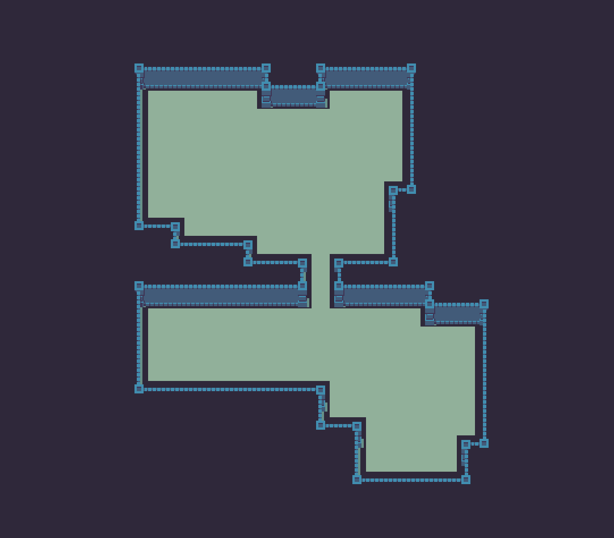

# The Keep

A game done for the April 2017 Lisp Gamejam

[PLAY IT NOW!](https://retrogradeorbit.github.io/thekeep/)

FIXME: Write a one-line description of your library/project.

## Overview

Plug in your
game controller and use the analog stick to control your character.
Press a button to swing your sword. Hold down a button to keep swinging your sword in circles.

Keyboard controls (arrow keys, space, 'z') or gamepad.

Get the highest score you can without being killed!

  

Written in ClojureScript in 10 days for April Lisp 2017 Gamejam

Source code: https://github.com/retrogradeorbit/thekeep

Developed with the InfiniteLives ClojureScript game framework:
https://infinitelives.github.io/ in particular:
https://github.com/infinitelives/infinitelives.pixi

Play it on itch.io: https://retrogradeorbit.itch.io/the-keep

Play on github.io: https://retrogradeorbit.github.io/thekeep/

More fun with an analog gamepad!

Runs best in Chrome

## Setup

Install the latest version of
[infinitelives.utils](https://github.com/infinitelives/infinitelives.utils).
Clone the repo, go into the directory and issue `lein install` to
install the jar into your local maven repo.

Do the same for
[infinitelives.pixi](https://github.com/infinitelives/infinitelives.pixi).
Clone the repo, go into the directory and issue `lein install` to
install the jar into your local maven repo.

To get an interactive development environment run:

    lein figwheel

and open your browser at [localhost:3449](http://localhost:3449/).
This will auto compile and send all changes to the browser without the
need to reload. After the compilation process is complete, you will
get a Browser Connected REPL. An easy way to try it is:

    (js/alert "Am I connected?")

and you should see an alert in the browser window.

To clean all compiled files:

    lein clean

To create a production build run:

    lein do clean, cljsbuild once min

And open your browser in `resources/public/index.html`. You will not
get live reloading, nor a REPL.

## License

Copyright © 2014 FIXME

Distributed under the Eclipse Public License either version 1.0 or (at your option) any later version.
